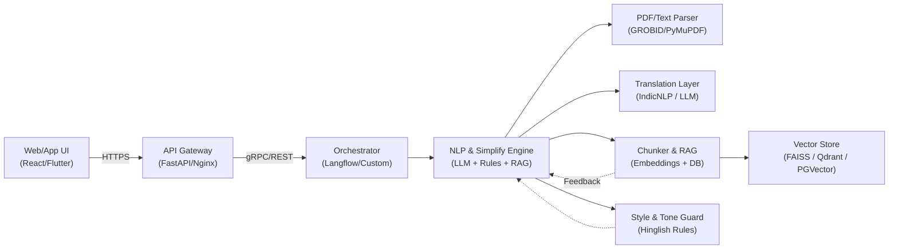

# SaralAI: The Research Paper Simplifier

**_Samjho research, aasaani se!_**

[](https://github.com)
[](https://opensource.org/licenses/MIT)
[](https://github.com)

SaralAI is a friendly AI assistant designed to help Indian students, professionals, and curious minds understand complex research papers. It breaks down difficult academic English into simple, conversational Hinglish and highlights the most important points.

## 📝 Table of Contents

- [The Problem We Solve](#-the-problem-we-solve)
- [Our Solution](#-our-solution)
- [✨ Core Features](#-core-features)
- [🎯 Target Audience](#-target-audience)
- [🏗️ System Architecture](#️-system-architecture)
  - [High-Level Diagram](#high-level-diagram)
  - [Component Breakdown](#component-breakdown)
- [🧠 The AI Core: Simplification Pipeline](#-the-ai-core-simplification-pipeline)
- [🌐 Multi-Language Support Strategy](#-multi-language-support-strategy)
- [🚀 Tech Stack](#-tech-stack)
- [API Design (Example)](#api-design-example)
- [Future Roadmap](#future-roadmap)
- [Getting Started](#getting-started)
- [Contributing](#contributing)

## 😠 The Problem We Solve

Research papers are a treasure of knowledge, but they are often written in dense, academic English filled with jargon. This makes it very difficult for many Indian students and even professionals to access and understand cutting-edge information. The language barrier is a real obstacle to learning.

## 😊 Our Solution

SaralAI acts as a smart friend who has already read the paper and is explaining it to you in a simple, easy-to-understand way. We use AI to:

1.  **Simplify:** Convert complex sentences into easy English.
2.  **Translate:** Mix simple Hindi words to create natural-sounding Hinglish that feels like a conversation.
3.  **Summarize:** Pull out the "matlab ki baat" (the main points) so you can get the gist quickly.

## ✨ Core Features

* **Hinglish Simplification**: Translates tough academic text into everyday Hinglish. We use easy Hindi words like `samajhna`, `zaroori`, `fayda` instead of complex ones.
* **Clear & Simple Language**: Explanations are short, direct, and conversational. Just like a friend explaining a concept.
* **Key Takeaways**: Automatically generates bullet points of the most important findings and conclusions from the paper.
* **Multi-Language Ready**: The architecture is built to easily add new languages in the future (e.g., Pure Hindi, Tamil, Bengali, or even English-only simplification).

## 🎯 Target Audience

* **Students**: College students trying to understand research for their projects and coursework.
* **Professionals**: Engineers, doctors, and other professionals who need to stay updated with the latest research in their field.
* **General Audience**: Anyone curious about a scientific or academic topic but intimidated by the language.

## 🏗️ System Architecture

Our system is designed using a microservices-based architecture to ensure scalability, flexibility, and easy maintenance.

### High-Level Diagram



### Component Breakdown

1.  **Frontend (Client)**
    * **Technology**: Next.js (React)
    * **Responsibility**: Provides the user interface (UI). Users can paste text, upload a PDF, or enter a URL to a research paper. It handles user input and displays the simplified output in a clean, readable format.

2.  **Backend API Gateway**
    * **Technology**: FastAPI (Python)
    * **Responsibility**: The main entry point for all requests from the frontend. It handles request validation, authentication (in the future), and routes traffic to the appropriate microservice (like the AI Core Service).

3.  **AI Core Service (The Brain)**
    * **Technology**: Python, LangChain/LlamaIndex
    * **Responsibility**: This is where the magic happens. It receives text from the API Gateway, processes it through our AI pipeline, and returns the simplified content. It is a stateless service, making it easy to scale horizontally.

4.  **User Service**
    * **Technology**: Node.js (Express)
    * **Responsibility**: Manages user accounts, login/signup, and saves user history (e.g., previously simplified papers). This is kept separate for focused development.

5.  **Database**
    * **Technology**: PostgreSQL
    * **Responsibility**: Stores user data, saved articles, and user feedback. We chose PostgreSQL for its reliability and powerful querying capabilities.

## 🧠 The AI Core: Simplification Pipeline

The AI Core Service follows a clear pipeline for each request:

1.  **Input Parsing**: It first extracts clean text from the input (whether it's raw text, a PDF, or a webpage). Libraries like `PyMuPDF` are used for parsing PDFs.

2.  **Text Chunking**: Research papers are long. The text is broken down into smaller, logical chunks (e.g., paragraphs or sections) to be processed effectively by the Language Model (LLM). This ensures we don't exceed token limits and maintain context.

3.  **Prompt Engineering**: For each chunk, we send a carefully crafted prompt to the LLM. The prompt is the key to our unique Hinglish style.

    > **Example Prompt Snippet:**
    >
    > ```
    > You are 'SaralAI', a helpful assistant for Indian students. Your task is to explain the following complex academic text in simple Hinglish.
    >
    > Rules:
    > 1. Use simple, everyday English and Hindi words.
    > 2. Explain it like you are talking to a friend in a classroom.
    > 3. Keep it short and clear.
    > 4. Avoid difficult Hindi words like 'avbodh'; use 'samajhna' instead.
    >
    > Original Text: "The novel therapeutic intervention demonstrated a statistically significant reduction in pathological biomarkers."
    >
    > Your Hinglish Explanation:
    > ```

4.  **Output Formatting**: The LLM's response is received, and the service structures it into a clean JSON format, including the original text, the simplified Hinglish text, and a list of key points.

## 🌐 Multi-Language Support Strategy

The architecture is designed from the ground up to support multiple languages. This is achieved by abstracting the language logic within the **AI Core Service**.

* **Language Parameter**: The API endpoint will accept a `target_language` parameter (e.g., `en-hinglish`, `en-only`, `hi-pure`, `ta-in`).
* **Dynamic Prompting**: Based on the `target_language`, the AI Core Service will load a different prompt template. For Tamil, it would instruct the LLM to simplify in Tanglish (Tamil + English). For `en-only`, it would just simplify the English without adding Hindi.
* **Scalability**: Adding a new language is as simple as creating a new prompt template and adding the language code to our supported list. No major architectural changes are needed.

## 🚀 Tech Stack

* **Frontend**: Next.js, Tailwind CSS
* **Backend**: Python (FastAPI), Node.js (Express)
* **AI/ML**: Python, LangChain, Transformers, Pytorch/TensorFlow
* **LLM**: Gemini API / Fine-tuned Open-Source Models (e.g., Llama 3)
* **Database**: PostgreSQL
* **Deployment**: Docker, Kubernetes, AWS/GCP

## API Design (Example)

A request to our simplification endpoint would look like this:

**Endpoint**: `POST /api/v1/simplify`

**Request Body**:
```json
{
  "content": "The study's primary objective was to elucidate the molecular mechanisms underlying cellular apoptosis.",
  "source_type": "text",
  "target_language": "en-hinglish"
}
```

**Response Body**:
```json
{
  "status": "success",
  "data": {
    "original_chunk": "The study's primary objective was to elucidate the molecular mechanisms underlying cellular apoptosis.",
    "simplified_chunk": "Is study ka main goal yeh samajhna tha ki cells ke andar 'apoptosis' (programmed cell death) process ke peeche molecular level par kya hota hai.",
    "key_points": [
      "Study ka main maqsad cells ke death process ko aasaani se samajhna tha.",
      "Unhone molecular mechanisms par focus kiya."
    ]
  }
}
```

## Future Roadmap

* **Support for More Languages**: Adding support for Pure Hindi, Bengali, Tamil, Telugu, etc.
* **Browser Extension**: A Chrome/Firefox extension to simplify text on any webpage.
* **Interactive Explanations**: Allow users to click on a specific term in the simplified text to get an even more detailed, simple explanation.
* **User Feedback Loop**: Allow users to rate the quality of the simplification, which we can use to fine-tune our models.

## Getting Started

_Instructions on how to set up the project locally will be added here._

## Contributing

We welcome contributions! Please read our `CONTRIBUTING.md` file to learn how you can help make research accessible to all.

---
Made with ❤️ for India.
